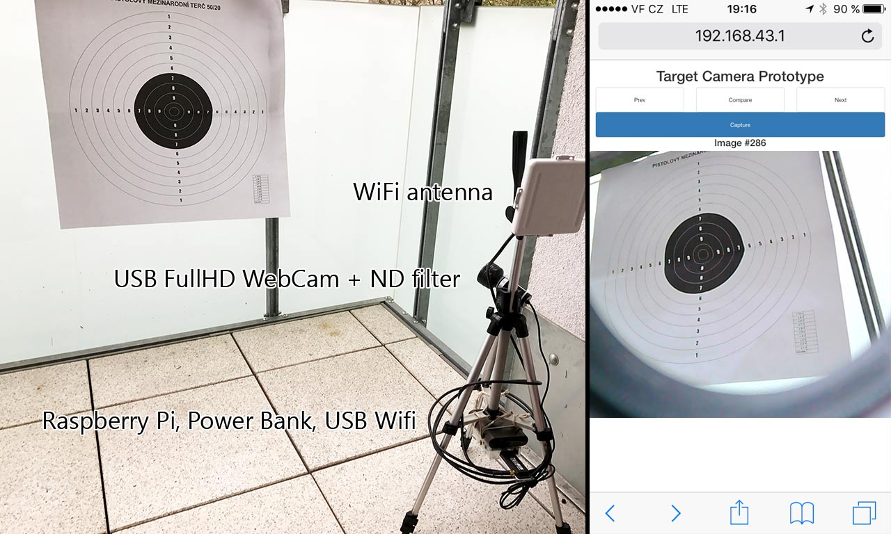

Target Line
=

Target Line is open-source shooting-range target imaging system for sport shooters. This device is placed next to your target and acts as WiFi hotspot. It enables you to view your target remotely on your mobile phone, tablet or computer. It was designed as DIY (do-it-yourself) alternative to expensive spotting scopes and commercial imaging systems. You can build it at home from globally available components.

Build our own guide
==

TBD

Required Hardware
===

**Raspberry PI** - tested on version 1 B+ but should work with newer as well (2, 3 etc.)

**Power Bank** - tested on _ADATA PV110 Power Bank 10400mAh_ (but 5000mAh+ is also enough) - important: some power banks turns off if low powered device is connected

**USB WiFi Adapter with antenna connector** - tested with cheap TP-LINK TL-WN722N with RP-SMA connector

**WiFi Antenna 2.5GHz** - tested on cheap JPA-9/PAN-9 with RP-SMA connector (made in Czech Republic)

**FullHD USB WebCam** - tested on _A4tech PK-910H Full HD WebCam_ (tried to use few cheaper cameras but sun light and detail was not good enough)

**Tripod** - tested with cheap MXS102 (1 meter) tripod

**ND filter / glass from sun glasses** - most of WebCams are designed to work indoor and on sun light your will need to filter some light - you can buy some camera ND filter or just use glass from old sun glasses

**Micro SD card + card reader** - any at least class 10 MicroSD - 4GB should be enough - remark: some MicroSD cards are sold together with MicroSD/SD converter that fits to oldest Raspberry PI 1 and is build-in lot of notebooks so you don't need card reader

Average price
===

Today (May 2017, Czech Republic) you can buy these specific components for about **3200 CZK** (**130 USD**)

* Raspberry PI 1 B+ - 900 CZK
* A4tech PK-910H Full HD WebCam - 640 CZK
* WiFi USB TP-LINK TL-WN722 - 300 CZK
* Antenna JPA-9 - 300 CZK
* Tripod MXS102 - 200 CZK
* SD card - 300 CZK
* Power Bank ADATA PV110 - 540 CZK
* Old sun glasses, duck tape and other stuff - 0 CZK (found home)

Status
==

Prototype. Documentation is not completed.

Features
==

* Battery powered

* Low power consumption - with 8000mAh battery it works all day

* Based on globally available components

* Tested on 400m (437yds) with multiple client devices (mobile phones)

* Any part of the system can be replaced in case of damage/failure

* Low price compared to commercial solutions

Contributors
==

* Tomas Jecha
